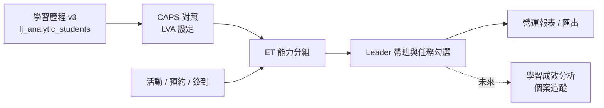

# EEARS English Table 能力分組與成效追蹤模組 PRD

**版本**：0.1（草案）  
**日期**：2026-06-29  
**狀態**：待主管／營運確認  
**相關已完成項目**：活動介紹（寫作工坊外部連結、卡片洗牌）、語彙連橋（自選難度＋ session 問卷推薦）、學習成效分析（平均／修正成長說明 UI）

---

## 1. 專案背景與目標

### 1.1 背景

主管希望 English Table（ET）能依學生英語能力提供**差異化帶領**：

- **系統分組**：依學習歷程中的英語能力（CAPS）自動建議／指派組別，而非僅依報名順序均分。
- **Leader 固定帶班**：ET Leader（桌長）可固定帶特定程度學生，減少「強弱混雜、討論難度不合」的情況。
- **場後成效勾選**：每次 ET 結束後，Leader 可勾選學生完成的任務項目，作為當次帶領成效的檢視依據。

目前 EEARS 已有：

| 現況 | 說明 |
|------|------|
| ET 預約／簽到／問卷 Gate | 學生端免登入；ET 問卷 gating 維持 fail-close |
| `reservations.group` 欄位 | DB 已存在，後台 ET 簽到／名單可顯示組別 |
| **舊分組邏輯** | `eventRouter` 將 ET 報名者依**預約順序**平均分到 **9 組**（`Group 1`…`Group 9`），**與英語能力無關** |
| 學習歷程 v3 + LVA | `lj_analytic_students` 含 `bestCefr`、各技能最佳分數；LVA 模組已有 CAPS 對照表 |
| 教師層級 | `teacherLevel = et_manager` 等，可作為 ET 營運權限基礎 |

本模組目標是將 ET 分組從「人數均分」升級為「**能力導向分組 + Leader 任務追蹤**」，並與學習歷程資料對齊。

### 1.2 核心目標

系統應協助中心回答：

1. 這場 ET 的學生依英語能力應如何分組？
2. 哪位 Leader 負責哪一組／哪個能力帶？
3. 帶完後，學生在當次任務上表現如何（可勾選、可匯總）？
4. 長期能否從任務完成率與學習歷程 CAPS 變化，觀察差異化帶領是否有效？（**觀察性**，不作因果宣稱）

### 1.3 非目標（本階段不做）

- **不**改變學生端登入模型（仍免登入預約）。
- **不**在學生預約流程強制顯示 CAPS 或分組結果（除非中心日後明確要求）。
- **不**取代培力英檢報名、問卷系統、黑名單、**2 小時**預約／取消截止。
- **不**實作「ET 專用試卷出題／線上測驗」（能力來源已定為學習歷程 CAPS；試卷若需另立專案）。
- **不**與語彙連橋 session 問卷寫入學習歷程（Phase 2 已約定僅當次推薦）。

---

## 2. 功能定位

### 2.1 模組名稱

- 中文：**EEARS ET 能力分組與成效追蹤**
- 英文建議：**EEARS ET Differentiated Grouping & Outcome Tracking**（簡稱 **ET-DGOT**）

### 2.2 與其他模組關係

- **讀取**學習歷程分析快照（CAPS／CEFR），**寫入** ET 場次分組與任務紀錄。
- 與 LVA 共用 CAPS 對照語意，避免兩套分數定義。

---

## 3. 設計原則

| 原則 | 說明 |
|------|------|
| **可解釋** | 分組結果需顯示依據（例如 best overall CAPS、資料日期、缺資料 fallback）。 |
| **可覆寫** | 自動分組為建議；`et_manager`／授權人員可手動調組。 |
| **可追溯** | 保留分組版本、操作者、任務勾選時間與修改紀錄（audit）。 |
| **最小侵入** | 沿用 `reservations.group`、既有 ET 後台簽到流程；不破壞 2hr／問卷 Gate。 |
| **隱私** | CAPS 僅後台／Leader 可見；學生端不預設曝光。 |
| **分階段** | 先「分組 + 手動勾選」，再「報表 + LVA 串接」。 |

---

## 4. 使用者與角色

| 角色 | 需求 |
|------|------|
| **ET 負責人（et_manager）** | 設定分組規則、指派 Leader、檢視全場分組與成效、匯出。 |
| **ET Leader（桌長）** | 查看自己負責組別名單、場後勾選任務、必要時補登。 |
| **一般教師／工讀** | 依權限簽到；是否可勾選任務由權限決定。 |
| **行政／執行長** | 跨場次統計、與學習歷程對照（唯讀為主）。 |
| **學生** | 行為不變：預約、到場、參與；**不登入**。 |

> **待確認**：Leader 是否一律為後台 `Teacher` 帳號，或包含學生桌長（若含學生，需另定權限與 PII 範圍）。

---

## 5. 能力資料來源（CAPS）

### 5.1 已定決策

- **英語能力來源**：學習歷程 **CAPS 內部分數**（與 LVA 模組一致）。
- **不**以語彙連橋、ET 問卷分數作為分組主依據（可作未來輔助欄位）。

### 5.2 建議讀取邏輯（草案）

對每位預約學生 `studentId`：

1. 查 `lj_analytic_students`（需學習歷程已重建）。
2. 取 **overall CAPS**：
   - **首選**：由 `bestCefr`（或四技能最高 CEFR）查 `LearningAnalyticsCapsLevel`／預設對照表換算 CAPS。
   - **次選**：若僅有 `baselineCefr`／`baselineEnglishScore`，標記為「僅基線資料」。
3. 若無任何英檢／基線資料 → **未分組／待人工**（不強制塞入最低組）。

### 5.3 缺資料策略（待確認）

| 策略 | 說明 | 建議 |
|------|------|------|
| A. 阻擋預約 | 無 CAPS 不可報 ET | ❌ 違反現行學生體驗底線風險高 |
| B. 預設最低組 | 一律 A1 組 | ⚠️ 可能誤導 Leader |
| C. **獨立「待確認」組** | 分組頁標示，Leader 現場口頭分派 | ✅ 建議預設 |
| D. 僅後台警告 | 仍可預約，分組時顯示黃標 | ✅ 與 C 併用 |

### 5.4 CAPS 顯示

- 後台顯示 **CEFR + CAPS 數值**（例如 `B1 · 350`）。
- 文案註明：CAPS 為內部分析分數，**非官方英檢成績**（與 LVA 免責一致）。

---

## 6. 分組規則

### 6.1 取代現行邏輯

**現行**（`GET /api/events/:id/reservations`、匯出 Excel）：

- 固定 9 組、依 `Reservation.id` 順序輪番填入。

**目標**：

- 組別由**能力區間**定義（可設定組數 ≠ 9）。
- 同一學生在單場 ET 僅屬一組。
- 結果寫入 `reservations.group`（語意化標籤，例如 `B1-口說強化` 或 `Group B1-A`）。

### 6.2 分組帶（Band）設定（中心可配置）

建議預設帶（**待營運確認**）：

| 帶別代碼 | CEFR 區間（overall） | CAPS 參考區間 | 帶領重點（文案） |
|----------|---------------------|---------------|------------------|
| `ET-A2` | A1–A2 | 0–349 | 基礎詞彙、句型、開口暖身 |
| `ET-B1` | B1 | 350–549 | 主題表達、延伸問答 |
| `ET-B2` | B2 | 550–749 | 觀點組織、反駁與舉例 |
| `ET-C1` | C1+ | ≥750 | 深度討論、學術／專業用語 |
| `ET-UNK` | 無資料 | — | 待 Leader 現場確認 |

- 組數 = 帶別數 × 每帶桌數（例如 B1 開 2 桌 → `ET-B1-1`、`ET-B1-2`）。
- **演算法（MVP）**：同帶內依 CAPS 排序後 round-robin 分配到各桌，兼顧每桌人數上限（可設 `maxPerTable`）。

### 6.3 手動調整

- 拖曳或下拉變更組別。
- 記錄 `adjustedBy`、`adjustedAt`、`reason`（選填）。
- 重新自動分組前需確認「將覆寫手動調整」。

### 6.4 與預約順序的關係

- 預約先後**不**再決定能力組；僅在同帶同桌已滿時，可選擇候補規則（待確認：候補名單是否也要依 CAPS 帶別）。

---

## 7. Leader 指派

### 7.1 概念

- 每場 ET、每個分組桌次可指派 1 位（或多位的話待確認）**Leader**。
- Leader 帳號建議綁定 `teachers` 表；顯示姓名供簽到頁辨識。

### 7.2 功能

- ET 負責人於分組頁指派／更換 Leader。
- Leader 登入後台僅見**自己負責組別**（scope：`english_table` + 該場 `eventId`）。
- 可選：記住「B1 帶固定 Leader 王小明」的**學期偏好**（減少每場重複指派）。

### 7.3 待確認

- 一場 ET 實際有幾桌？是否永遠對應 9 組，還是依場地動態？
- 學生桌長是否需進系統？

---

## 8. 任務清單（Rubric）— 從零定義

### 8.1 設計方式

- 中心於後台維護 **ET 任務模板**（依能力帶或全域共用）。
- 每個任務項：`code`、`label`、`description`、`bandScope`（適用帶別）、`sortOrder`、`isRequired`。
- **初版建議 8–12 項**，分「可觀察行為」而非抽象評分。

### 8.2 建議任務項（草案，供討論）

**共通（所有帶）**

| 代碼 | 任務描述 |
|------|----------|
| `ATTEND` | 完成簽到並全程參與 |
| `PARTICIPATE` | 至少主動發言 2 次 |
| `PEER` | 能回應同組同學提問 |

**A2 帶加強**

| 代碼 | 任務描述 |
|------|----------|
| `A2_VOCAB` | 使用當週主題詞彙 ≥3 個 |
| `A2_SENT` | 能以完整句回答問題 |

**B1+ 帶加強**

| 代碼 | 任務描述 |
|------|----------|
| `B1_REASON` | 能說明理由（because / since） |
| `B1_FOLLOW` | 能針對他人觀點追問或延伸 |

**B2+ 帶加強**

| 代碼 | 任務描述 |
|------|----------|
| `B2_STANCE` | 能表明立場並舉例 |
| `B2_REBUT` | 能禮貌反駁或提出替代方案 |

### 8.3 勾選流程

1. 活動狀態為「進行中」或「已結束」後，Leader 進入**任務勾選**頁。
2. 列出該組已簽到學生 × 適用任務（checkbox grid）。
3. 支援「全組套用預設」、單人全選／清除。
4. **儲存即寫入**；允許在場後 **N 天內**補登（天數待確認，建議 3）。
5. 學生不可自行修改。

### 8.4 與簽到關係

- 建議僅對 `checkinStatus = 已簽到` 的學生開放勾選；未到場可顯示但 disabled。

---

## 9. 資料模型（提案）

### 9.1 新增資料表（建議）

**`et_group_band_configs`** — 學期／全域分組帶設定

| 欄位 | 說明 |
|------|------|
| `id` | PK |
| `semesterId` | 學期（可 null = 全域預設） |
| `code` | 如 `ET-B1` |
| `label` | 顯示名稱 |
| `cefrMin` / `cefrMax` | 或 `capsMin` / `capsMax` |
| `maxPerTable` | 每桌人數上限 |
| `sortOrder` | 排序 |
| `isActive` | 是否啟用 |

**`et_event_group_plans`** — 單場 ET 分組計畫

| 欄位 | 說明 |
|------|------|
| `id` | PK |
| `eventId` | FK → events |
| `status` | `draft` / `published` / `locked` |
| `algorithmVersion` | 分組演算法版本 |
| `generatedAt` | 自動產生時間 |
| `publishedBy` | 發布者 |

**`et_event_group_assignments`** — 學生在某場的分組結果

| 欄位 | 說明 |
|------|------|
| `id` | PK |
| `eventId` | FK |
| `reservationId` | FK → reservations |
| `studentId` | 冗餘便於查詢 |
| `bandCode` | 能力帶 |
| `groupLabel` | 寫入 `reservations.group` 的標籤 |
| `capsSnapshot` | 分組當下 CAPS |
| `cefrSnapshot` | 分組當下 CEFR |
| `dataQuality` | `high` / `baseline_only` / `missing` |
| `source` | `auto` / `manual` |
| `leaderTeacherId` | 可 null |

**`et_task_templates`** / **`et_task_template_items`**

- 任務主檔與細項（見 §8）。

**`et_session_task_marks`** — 場次任務勾選

| 欄位 | 說明 |
|------|------|
| `id` | PK |
| `eventId` | FK |
| `reservationId` | FK |
| `taskItemId` | FK |
| `completed` | boolean |
| `markedBy` | teacher id |
| `markedAt` | datetime |

### 9.2 沿用欄位

- `reservations.group`：與 `groupLabel` 同步，維持既有簽到／匯出 UI 相容。
- `events`：可選加 `groupingMode`（`legacy_sequential` / `ability`）以利漸進切換。

---

## 10. API 概要（草案）

| 方法 | 路徑 | 說明 | 權限 |
|------|------|------|------|
| GET | `/api/admin/et-grouping/bands` | 列出分組帶設定 | et_manager+ |
| PUT | `/api/admin/et-grouping/bands` | 更新分組帶 | et_manager+ |
| GET | `/api/admin/events/:id/grouping` | 取得分組計畫＋名單＋CAPS 快照 | 活動 scope |
| POST | `/api/admin/events/:id/grouping/generate` | 依 CAPS 自動分組 | 活動 scope |
| PATCH | `/api/admin/events/:id/grouping/assignments` | 手動調組／指派 Leader | 活動 scope |
| POST | `/api/admin/events/:id/grouping/publish` | 發布分組（寫入 reservations.group） | 活動 scope |
| GET | `/api/admin/et-tasks/templates` | 任務模板 | et_manager+ |
| PUT | `/api/admin/et-tasks/templates/:id` | 編輯模板 | et_manager+ |
| GET | `/api/admin/events/:id/task-marks` | 取得勾選矩陣 | Leader / et_manager |
| PUT | `/api/admin/events/:id/task-marks` | 儲存勾選 | Leader / et_manager |
| GET | `/api/admin/events/:id/grouping/export` | 匯出（分組＋CAPS＋任務） | 匯出權限 |

**學生端**：不新增 API（除非日後要在預約成功信顯示組別）。

---

## 11. 前端頁面（草案）

| 頁面 | 路徑建議 | 說明 |
|------|----------|------|
| ET 分組帶設定 | `/admin/et-grouping/settings` | 學期帶別、CAPS 區間、每桌人數 |
| ET 任務模板 | `/admin/et-grouping/tasks` | 維護 rubric |
| **活動詳情 · 分組** | 既有活動詳情新 Tab | 自動分組、手動調整、指派 Leader、發布 |
| **活動詳情 · 任務成效** | 同上或子 Tab | Leader 勾選矩陣 |
| 場次報表 | `/admin/et-grouping/reports` | 依學期／Leader／帶別彙總 |

需同步：`adminRouteAccess.js`、`adminNavigation.js`、`permissions.js`。

---

## 12. 權限（草案）

| 權限鍵 | 說明 |
|--------|------|
| `CAN_MANAGE_ET_GROUPING` | 設定分組帶、任務模板、發布分組 |
| `CAN_VIEW_ET_GROUPING` | 檢視分組與 CAPS 快照 |
| `CAN_MARK_ET_SESSION_TASKS` | 勾選場次任務（Leader） |
| `CAN_EXPORT_ET_GROUPING` | 匯出分組／成效報表 |

- `et_manager` 預設具備上述管理權；一般 teacher 僅 `CAN_MARK` 於被指派場次。

---

## 13. 報表與分析（Phase 2+）

| 報表 | 說明 |
|------|------|
| 單場分組一覽 | 各組人數、CAPS 分布、Leader |
| Leader 成效表 | 任務完成率（依組／依帶） |
| 學期趨勢 | 同一學生多次 ET 任務完成趨勢 |
| **與 LVA 串接（未來）** | 對照 CAPS 成長與 ET 參與／任務完成（觀察性） |

---

## 14. 實施階段建議

### Phase A — 分組 MVP（4–6 週）

- [ ] CAPS 讀取服務（`studentId` → snapshot）
- [ ] 分組帶設定 CRUD（預設 4 帶 + UNK）
- [ ] 單場自動分組 + 手動調整 + 寫入 `reservations.group`
- [ ] 取代 `eventRouter` 內 9 組順序邏輯（feature flag：`groupingMode`）
- [ ] 後台分組 Tab + 匯出更新
- [ ] 測試：無 CAPS、手動覆寫、問卷 Gate／預約不受影響

### Phase B — Leader 與任務（3–4 週）

- [ ] 任務模板後台
- [ ] Leader 指派與 scope
- [ ] 任務勾選 UI + API + audit
- [ ] 場次報表（完成率）

### Phase C — 優化與串接（待定）

- [ ] 學期 Leader 偏好、每帶多桌進階規則
- [ ] 與 LVA 學習軌跡頁互跳
- [ ] 個人化活動推薦（學習軌跡 → 寫作工坊等，對齊主管長期願景）

---

## 15. 風險與緩解

| 風險 | 緩解 |
|------|------|
| 學習歷程未重建 → 大量 UNK | 分組頁顯示資料健康；沿用 LJ 維運提示 |
| CAPS 與現場感受不一致 | 允許手動調組；顯示快照日期 |
| Leader 負擔過重 | 任務項精簡、支援批次勾選、補登期限 |
| 舊報表依 9 組 | `groupingMode` 並行；匯出標註模式 |
| 隱私 | CAPS 僅授權後台；日誌遮罩 PII |

---

## 16. 驗收標準（MVP）

1. ET 場次可一鍵依 CAPS 產生能力分組，並發布至簽到名單。
2. 後台可見每位學生分組依據（CEFR／CAPS／資料品質）。
3. `et_manager` 可手動調組，且覆寫紀錄可追查。
4. Leader 可於場後對已簽到學生勾選任務並儲存。
5. 匯出 Excel 含組別、CAPS 快照、任務完成欄（Phase B）。
6. 學生預約／取消／問卷 Gate／2hr 截止行為與現行一致（迴歸測試通過）。

---

## 17. 待主管／營運確認事項

1. **分組帶預設**：上表 A2／B1／B2／C1 是否合適？是否需要「只分 3 帶」？
2. **每場桌數**：是否固定 9 桌，還是依 `maxCapacity` 動態？
3. **無 CAPS 學生**：採「待確認組」是否可接受？
4. **CAPS 取值**：overall 用 `bestCefr` 還是口說技能優先（ET 場景）？
5. **Leader 身分**：僅教職員帳號，或含學生桌長？
6. **任務 rubric**：§8.2 草案是否需中心語言學專家修訂？
7. **勾選時限**：場後可補登幾天？
8. **學生是否需知悉組別**（Email／現場看板）？
9. **舊制 9 組平行過渡期**要多長？

---

## 18. 附錄：現行程式對照

| 項目 | 路徑 |
|------|------|
| 舊 9 組邏輯 | `reservation-backend/routes/eventRouter.js` |
| 組別欄位 | `reservation-backend/models/Reservation.js` → `group` |
| 簽到顯示組別 | `reservation-frontend/.../AdminEventCheckinTab.jsx` |
| 學習歷程分析 | `reservation-backend/models/LjAnalyticStudent.js` |
| CAPS 對照 | `reservation-backend/services/learningAnalytics/learningAnalyticsCapsMappingService.js` |
| ET 權限 | `teacherLevel: et_manager`、`surveyScopeGuard` |

---

## 19. 修訂紀錄

| 版本 | 日期 | 說明 |
|------|------|------|
| 0.1 | 2026-06-29 | 初稿：依主管摘要與 Phase 1–3 決策撰寫 |
