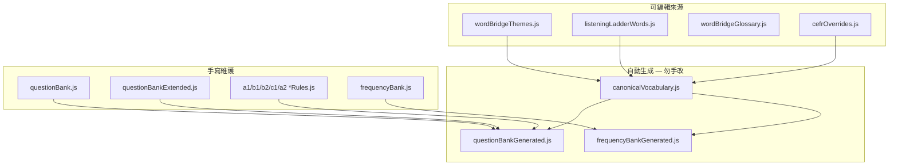

# EEARS 字彙庫維護 Runbook

**版本**：1.0  
**適用**：Word Bridge、Listening Ladder、Vocabulary Depth、Vocabulary Size  
**原則**：**單一權威來源（canonical）→ 衍生題庫自動生成；手寫題目與出題規則分離**

---

## 1. 架構概覽



| 層級 | 路徑 | 可否手改 | 說明 |
|------|------|----------|------|
| **來源** | `src/data/wordBridgeThemes.js` | ✅ | Word Bridge 主題詞 |
| | `src/data/learningContent/listeningLadderWords.js` | ✅ | 聽力階梯原始詞 + 干擾音 |
| | `src/data/wordBridgeGlossary.js` | ✅ | 補充中文／片語 |
| | `src/data/learningContent/vocabulary/cefrOverrides.js` | ✅ | CEFR 衝突覆寫 |
| **Canonical** | `src/data/learningContent/vocabulary/canonicalVocabulary.js` | ❌ | 合併後主詞庫 |
| **Depth 手寫** | `vocabularyDepth/questionBank.js` | ✅ | 每級核心題（約 6 題/級） |
| | `vocabularyDepth/questionBankExtended.js` | ✅ | 擴充手寫題 |
| **Depth 規則** | `vocabularyDepth/*Rules.js` | ✅ | 自動出題品質護欄 |
| **Depth 生成** | `vocabularyDepth/questionBankGenerated.js` | ❌ | 補足每級 ≥30 題 |
| **Size 手寫** | `vocabularySize/frequencyBank.js` | ✅ | 手寫頻率帶詞 |
| **Size 生成** | `vocabularySize/frequencyBankGenerated.js` | ❌ | 補足 250 詞 |

---

## 2. 常用指令

於 `reservation-frontend/` 執行：

| 指令 | 用途 |
|------|------|
| `npm run vocab:build` | **完整重建**（canonical → Depth/Size 衍生檔） |
| `npm run vocab:check` | 僅驗證能否成功建置（不寫檔） |
| `npm run vocab:audit` | CEFR 跨來源稽核報告 |
| `npm run vocab:verify` | 稽核 + 字彙相關 Jest 測試 |

個別步驟（進階）：

| 指令 | 說明 |
|------|------|
| `npm run build:vocabulary-bank` | 只重建 canonical |
| `npm run build:micro-learning-banks` | 只重建 Depth/Size 生成檔 |
| `npm run audit:cefr-banks` | 同 `vocab:audit` |

---

## 3. 變更情境與步驟

### 3.1 新增／修改 Word Bridge 或 Listening Ladder 詞

1. 編輯 `wordBridgeThemes.js` 和／或 `listeningLadderWords.js`（新詞**必須**有 `zh`）
2. 若 WB 與 LL 的 CEFR 差距 ≥1 級 → 在 `cefrOverrides.js` 加覆寫
3. 執行：

```bash
cd reservation-frontend
npm run vocab:build
npm run vocab:verify
```

4. 提交：**來源檔 + 所有生成檔**（`canonicalVocabulary.js`、`questionBankGenerated.js`、`frequencyBankGenerated.js`）

### 3.2 新增 Vocabulary Depth 手寫題

1. 編輯 `questionBank.js` 或 `questionBankExtended.js`
2. 確認 `word` 不重複（生成腳本會跳過已用手寫詞）
3. 若為 A2/B1/B2/C1 自動型題，同步更新對應 `*Rules.js`
4. `npm run vocab:verify`（不必重建 canonical，除非換了新詞）

### 3.3 調整自動出題規則（防洩題）

| 級別 | 規則檔 |
|------|--------|
| A1 definition | `a1DefinitionRules.js` |
| A2 context | `a2ContextRules.js` |
| B1 synonym | `b1SynonymRules.js` |
| B2 collocation | `b2CollocationRules.js` |
| C1 nuance | `c1NuanceRules.js` |

修改後：

```bash
npm run build:micro-learning-banks
npm run vocab:verify
```

### 3.4 僅調整 CEFR 等級

1. 編輯 `cefrOverrides.js`（必要時同步調整 WB/LL 來源）
2. `npm run vocab:build && npm run vocab:audit`

---

## 4. PR 前檢查清單

- [ ] 未手改 `canonicalVocabulary.js`、`questionBankGenerated.js`、`frequencyBankGenerated.js`
- [ ] 新詞皆有中文釋義 `zh`
- [ ] `npm run vocab:verify` 通過
- [ ] B1 同義題：四選項首字母不可只有正解落單（見 `validateB1OptionLetterBalance`）
- [ ] Depth 選項：英文顯示、不含題幹中文釋義洩漏
- [ ] 每級 Depth ≥30 題、Size 總詞 ≥250（由生成腳本驗證）

---

## 5. 查詢 API

```javascript
import {
  CANONICAL_VOCABULARY,
  getCanonicalEntry,
  getWordZh,
  getVocabularyByLevel,
} from '../data/learningContent/vocabulary';
```

微學習遊戲應透過 canonical 或各模組 `questionBank` / `frequencyBank` 讀取，**勿**在元件內硬編碼詞表。

---

## 6. 相關文件

- [Vocabulary Depth PRD](./vocabulary-depth-prd.md)
- [AGENTS.md](../../AGENTS.md) — 微學習模組對照
